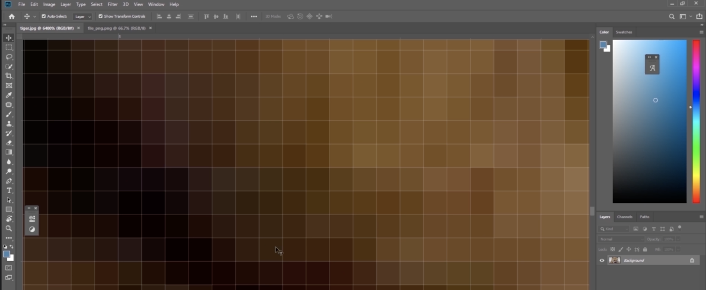

# 簡介

SVG = Scalable Vector Graphics

## 點陣式

JPEG、PNG、GIF 的圖檔格式皆屬於點陣式，將圖片放大會有模糊的現象，如下圖：

<figure><figcaption></figcaption></figure>

## 向量式

SVG 的圖檔是屬於向量式，也就是將圖片放大的話，不會有模糊的現象。

SVG 的格式是 XML 的格式。

## 範例：使用 SVG 畫貓



