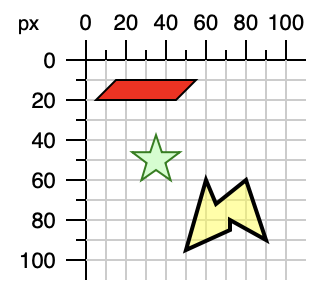

# polygon

## 使用 polygon 來畫多邊形

* `points="15,10 55,10 45,20 5,20"`：以空格來區分每個座標的點，然後例如 `15,10` 這就是一個點的座標(x 是 15、y 是 10)。或者也可以是用逗號來區分每個座標的點，然後用空格來區分 x、y(參考以下的第三個 polygon 的寫法)
* 會沿著座標先寫的順序來畫。
* 最後一個點(Point)，會自動畫回到第一個點(Point)，成為一個封閉的多邊形。

```markup
<svg width="200px" height="200px" viewBox="0 0 200 200" xmlns="http://www.w3.org/2000/svg">
  <polygon points="15,10 55,10 45,20 5,20" style="fill: red; stroke: black;" />
  <polygon points="35,37.5 37.9,46.1 46.9,46.1 39.7,51.5 42.3,60.1 35,55 27.7,60.1 30.3,51.5 23.1,46.1 32.1,46.1" style="fill: #ccffcc; stroke: green;" />
  <!-- 以下這個的 60 60 是一個點的座標 -->
  <polygon points="60 60, 65 72, 80 60, 90 90, 72 80, 72 85, 50 95" style="fill: yellow; fill-opacity: 0.5; stroke: black; stroke-width: 2;" />
</svg>
```


例：




## 點(Point)是在多邊形的內部還是外部

例1：先畫星形



然後看下方的相關樣式。


## 相關樣式

* `fill-rule`： `nonzero` (預設)； `evenodd` 。[說明參考](https://www.itread01.com/content/1547601139.html)。


例：




## 參考

[http://oreillymedia.github.io/svg-essentials-examples/ch04/polygon.html](http://oreillymedia.github.io/svg-essentials-examples/ch04/polygon.html)

示意圖1：



示意圖2：


示意圖3：


