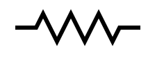

# polyline

## 使用 polyline 來畫非封閉的圖形

* `points="5 20, 20 20, 25 10, 35 30, 45 10, 55 30, 65 10, 75 30, 80 20, 95 20"`：各自點(Point)的座標。
* 建議設定 `fill: none;` ，否則會有預設的黑色填滿。

例：



## 相關樣式

* `stroke-linecap`：`butt`(預設)、`round`、`square`。

例：



* `stroke-linejoin`：`miter`(預設)、`round`、`bevel`。

例：



* `stroke-miterlimit`：預設值為 4。

## 參考

例1：

[http://oreillymedia.github.io/svg-essentials-examples/ch04/polyline.html](http://oreillymedia.github.io/svg-essentials-examples/ch04/polyline.html)

示意圖：

例2：

[http://oreillymedia.github.io/svg-essentials-examples/ch04/linecap.html](http://oreillymedia.github.io/svg-essentials-examples/ch04/linecap.html)

示意圖：

例3：

[http://oreillymedia.github.io/svg-essentials-examples/ch04/linejoin.html](http://oreillymedia.github.io/svg-essentials-examples/ch04/linejoin.html)

示意圖：

